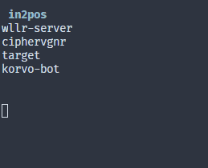

<h1 align="center">target-menu</h1>
<h3 align="center">Um simples menu customizável utilizando o terminal</h3>
<h1 align="center">
    
</h1>

# Sumário

* [Instalação](#Instalação)  
* [Usando](#Usando)  
  * [Submenu](#Submenu)  
  * [Flexmenu](#Flexmenu)  
    * [Estrutura do Menu variável](#Estrutura-do-Menu-variável)  
    * [Retorno do flexMenu](#Retorno-do-flexMenu)  
* [Controles](#Controles)  

---

# Instalação

```npm install target-menu```

# Usando

```js
// 1 - faça require do módulo
var target = require('target-menu');

// 2 - crie os controles
var control = new target.Controls();

// 3 - crie o(s) menu(s)
//NOTA: submenu é opcional
var example = [
    'item',
    'item',
    'item',
    'item',
    'item',
];
var sub = ['alterar', 'excluir'];

// 4 - faça um loop chamando o menu
while (control.pos1 >= 0) {
        target.menu(control, 'cyan', example, sub);
    // 5 - faça um ponto de saida logo em seguida
    if (control.pos1 == -1) {
            console.clear();
            return 0;
        }
    // 6 - chame suas funções baseadas nos seletores do menu
    if (control.pos2 == 0) {
        yourFunction(control.pos1);
    } else if (control.pos2 == 1) {
        yourSecondFunction(control.pos1);
    }
}
```

[Voltar ao Sumário](#Sumário)  
## Submenu
O uso do submenu é opcional e indicado apenas quando o menu principal tem o mesmo submenu para seus itens, exemplo: listas. Quando utilizado o **.pos1** indicará o item do menu principal selecionado, e o **.pos2** a função que será aplicada neste item.

Se não for utilizar o submenu o omita da função e utilize apenas **.pos1**

[Voltar ao Sumário](#Sumário)  
## Flexmenu
O flexMenu contorna o problema dos submenus, ele permite que sejam utilizados submenus diferentes para cada item que compõe o menu, porém sua sintaxe é diferente.

### Estrutura do Menu variável
A variável que armazena este tipo de menu é um Array, esse array contém dentro de si outro Array onde: **a primeira posição é o item a ser exibido no menu** e **a segunda posição é o submenu deste item** *que pode ser omitido*.

### Retorno do flexMenu
Quando não houver submenu o flexMenu retornará o item selecionado em forma de array porém os indicadores de posição dos controles ainda podem ser utilizados.

```js
// 1 - faça require do módulo
var target = require('target-menu');

// 2 - crie os controles
var control = new target.Controls();

// 3 - crie a estrutura de menus
let menu = [
    ['profile'],
    ['social', ['instagram', 'twitter', 'discord', 'steam']],
    ['following'],
    ['followed']
];

(function exampleFlexMenu() {
    let selected; // 4 - crie uma variável para armazenar o retorno do menu (quando ele não possuir submenu)
    while (control.pos1 >= 0) { // 5 - faça um loop chamando o menu
        selected = flexMenu(control, 'green', menu, 'v');

        switch (control.pos1) { // 6 - faça a estrutura que manipalará o menu (utilize ifs ou switch)
            case -1:
                break;
            case 0:
                print(selected); // output : ['profile']
                break;
            case 1:
                print(menu[control.pos1][1][control.pos2]);
                break;
            case 2:
                print(selected[0]); // output : following
                break;
            case 3:
                print(selected);
                break;
        }
    }
})();
```

[Voltar ao Sumário](#Sumário)  
# Controles

A classe controles possui além das teclas responsáveis pelo direcionamento do menu, a posição atual do seletor no menu **.pos1** e **.pos2** que devem ser utilizados para se referir as funções dos mesmos depois de selecionados.


Os controles padrões utilizando:
```js
    var control = new Controls();
```

| função | Tecla |
|-|-|
| selecionar | e |
| voltar/sair | q |
| cima | w |
| baixo | s |
| direita | d |
| esquerda | a |

> **Nota**: você pode customizar os controles passando como parâmetros seguindo a ordem acima: 
> ```js
>     var control = new target.Controls('o', 'u', 'i','k', 'l', 'j');
> ```
[Voltar ao Sumário](#Sumário)  
